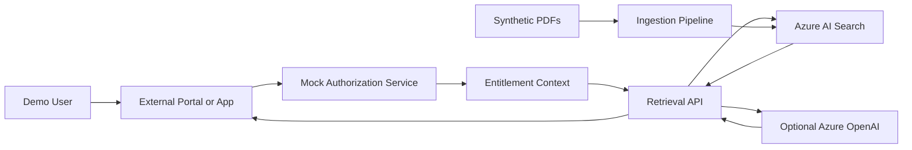

# Azure AI Search Entitlement Filtering Demo

> **This demo intentionally does not use real users, real customers, real documents, or real business data. It demonstrates a reusable pattern where an external application or portal owns authorization and passes entitlement context into Azure AI Search as query-time filters.**

---

## Overview

This repository demonstrates how **Azure AI Search** can enforce **metadata-based entitlement filtering** during retrieval. The pattern ensures that users only retrieve document chunks they are explicitly authorized to access — and that unauthorized content is never sent to a language model.

This is a generic, reusable reference implementation suitable for any industry or scenario where:
- Authorization is owned by an external application or entitlement service
- Documents contain business-sensitive metadata (partner, client, product line, region)
- Fine-grained access control at retrieval time is required

---

## Architecture



### Key Architectural Principles

1. **Authentication ≠ Authorization** — Knowing who a user is does not determine what they can access.
2. **Authorization is external** — An entitlement service or portal determines what each user is allowed to see.
3. **Azure AI Search enforces query-time filtering** — OData filters built from entitlements are applied to every search query.
4. **Deny-by-default** — If no entitlements are found for a user, no content is returned.
5. **LLM never sees unauthorized content** — Only filtered chunks are passed as context to Azure OpenAI.
6. **Generic and reusable** — No dependency on SharePoint, Microsoft Foundry, Copilot Studio, or any specific platform.

---

## Repository Structure

```
azure-ai-search-entitlement-filtering-demo/
  azure.yaml                        # Azure Developer CLI configuration
  README.md                         # This file
  .env.sample                       # Environment variable template
  Makefile                          # Common development commands
  requirements.txt                  # Python dependencies
  infra/
    main.bicep                      # Azure infrastructure (IaC)
    main.parameters.json            # Bicep parameters
    abbreviations.json              # Resource naming abbreviations
  sample-docs/                      # Generated synthetic PDFs (run generate_sample_pdfs.py)
  src/
    ingestion/
      generate_sample_pdfs.py       # Generates synthetic PDF documents locally
      ingest_documents.py           # Ingests PDFs into Azure AI Search
      chunking.py                   # Document chunking logic
      embeddings.py                 # Embedding generation (requires Azure OpenAI)
      index_schema.py               # Azure AI Search index definition
      metadata.json                 # Entitlement metadata for sample documents
    api/
      main.py                       # FastAPI application entry point
      search.py                     # Search execution logic
      entitlements.py               # Mock entitlement service
      filters.py                    # OData filter builder
      models.py                     # Pydantic request/response models
    web/
      package.json                  # React frontend dependencies
      index.html                    # HTML entry point
      src/                          # React source code
  docs/
    architecture.md                 # Detailed architecture documentation
    security-model.md               # Security model and threat considerations
    sample-queries.md               # Demo script with sample queries
  tests/
    test_entitlements.py            # Entitlement service tests
    test_filter_builder.py          # OData filter construction tests
    test_search_authorization.py    # Search authorization enforcement tests
    test_no_unfiltered_search.py    # Verify no unfiltered search is possible
```

---

## Why Metadata Entitlement Filtering?

In many enterprise scenarios, documents belong to specific business entities — partners, clients, product lines, or regions. Access to these documents is governed by business rules that live outside of the document storage system.

Azure AI Search does not natively authenticate end users or enforce ACLs at the document level. This demo shows the **application-enforced metadata filter pattern**:

- At ingestion time, documents are tagged with entitlement metadata.
- At query time, the retrieval API builds OData filters from the user's entitlement context.
- Azure AI Search applies those filters before returning results.
- Unauthorized documents are never included in results — and never sent to an LLM.

---

## Demo Personas

| User ID | Display Name | Partner | Allowed Clients | Allowed Products | Allowed Regions |
|---|---|---|---|---|---|
| `user.alpha.north@example.com` | User Alpha North | PartnerAlpha | ClientNorth | ProductLineA | RegionOne |
| `user.alpha.south@example.com` | User Alpha South | PartnerAlpha | ClientSouth | ProductLineA, ProductLineB | RegionOne, RegionTwo |
| `user.beta.east@example.com` | User Beta East | PartnerBeta | ClientEast | ProductLineB | RegionTwo |
| `user.global.reader@example.com` | Global Reference Reader | Global | *(none)* | *(none)* | *(none)* |

All users can read documents classified as `PublicDemoReference` when `canReadGlobalReferences` is true.

---

## Sample Documents

| File | Partner | Client | Product | Region | Classification |
|---|---|---|---|---|---|
| partner-alpha-client-north-overview.pdf | PartnerAlpha | ClientNorth | ProductLineA | RegionOne | RestrictedDemo |
| partner-alpha-client-south-product-line-a-summary.pdf | PartnerAlpha | ClientSouth | ProductLineA | RegionOne | RestrictedDemo |
| partner-beta-client-east-operational-review.pdf | PartnerBeta | ClientEast | ProductLineB | RegionTwo | RestrictedDemo |
| shared-global-reference-guide.pdf | Global | *(all)* | *(all)* | *(all)* | PublicDemoReference |
| restricted-client-north-financial-summary.pdf | PartnerAlpha | ClientNorth | ProductLineA | RegionOne | RestrictedDemo |
| restricted-client-east-implementation-notes.pdf | PartnerBeta | ClientEast | ProductLineB | RegionTwo | RestrictedDemo |

---

## Quickstart: Deploy with Azure Developer CLI

### Prerequisites

- [Azure Developer CLI (azd)](https://learn.microsoft.com/en-us/azure/developer/azure-developer-cli/install-azd)
- [Python 3.11+](https://www.python.org/downloads/)
- [Node.js 18+](https://nodejs.org/) (for frontend)
- An Azure subscription

### Deploy

```bash
# Clone the repository
git clone https://github.com/YOUR_ORG/azure-ai-search-entitlement-filtering-demo
cd azure-ai-search-entitlement-filtering-demo

# Copy environment template
cp .env.sample .env

# Deploy all Azure resources
azd up
```

`azd up` will:
1. Provision Azure AI Search, Storage Account, App Service, and (if available) Azure OpenAI
2. Deploy the backend API
3. Run the ingestion post-provision hook (if configured)

### Configure Azure OpenAI (Optional)

If Azure OpenAI is available in your target region, update `.env`:

```env
AZURE_OPENAI_ENDPOINT=https://YOUR_OPENAI.openai.azure.com/
AZURE_OPENAI_CHAT_DEPLOYMENT=gpt-4o
AZURE_OPENAI_EMBEDDING_DEPLOYMENT=text-embedding-3-small
ENABLE_LLM=true
```

If Azure OpenAI is not configured, the demo runs in **retrieval-only mode** — search and filtering still work; the `/api/chat` endpoint returns retrieval results with a message explaining that answer generation is disabled.

---

## Local Development

### 1. Install Python dependencies

```bash
pip install -r requirements.txt
```

### 2. Set environment variables

```bash
cp .env.sample .env
# Edit .env with your Azure AI Search endpoint and key
```

### 3. Generate synthetic sample PDFs

```bash
python src/ingestion/generate_sample_pdfs.py
```

This creates PDF files in the `sample-docs/` directory.

### 4. Ingest documents into Azure AI Search

```bash
python src/ingestion/ingest_documents.py
```

This will:
- Create the `entitlement-demo-index` index if it doesn't exist
- Extract text from PDFs in `sample-docs/`
- Chunk documents
- Attach metadata and entitlement fields to each chunk
- Generate embeddings (if Azure OpenAI is configured)
- Upload chunks to Azure AI Search

### 5. Run the backend API

```bash
python src/api/main.py
# API available at http://localhost:8000
```

### 6. Run the frontend

```bash
cd src/web
npm install
npm run dev
# Frontend available at http://localhost:5173
```

### 7. Deploy the UI as static assets (Option 1)

Build the React UI into static files and host them separately (for example, Azure Static Web Apps or Azure Storage static website).

```bash
cd src/web
cp .env.production.example .env.production
# Set VITE_API_BASE_URL to your deployed API URL
npm install
npm run build
```

Publish the generated `src/web/dist/` folder to your static host.

For cross-origin browser calls, set backend CORS origins in `.env` (or App Service settings):

```env
CORS_ALLOWED_ORIGINS=https://your-ui-host.example.com
```

---

## Sample Queries

See [docs/sample-queries.md](docs/sample-queries.md) for a full demo script.

Quick examples using the API directly:

```bash
# User Alpha North - should only see PartnerAlpha/ClientNorth content
curl -X POST http://localhost:8000/api/search \
  -H "Content-Type: application/json" \
  -d '{"userId": "user.alpha.north@example.com", "query": "implementation notes", "searchMode": "hybrid"}'

# Unknown user - should return empty results (deny-by-default)
curl -X POST http://localhost:8000/api/search \
  -H "Content-Type: application/json" \
  -d '{"userId": "unknown@example.com", "query": "all documents", "searchMode": "keyword"}'
```

## Compare Workflow

The app has no dedicated compare pane. Compare mode is manual: run the same
query for two users and compare the returned `filter`, result titles, and
`query-history` entries.

Smallest useful check:
1. Run `Summarize Product Line A implementation notes` as Alpha North.
2. Run the same query as Beta East.
3. Confirm the filters and result sets differ.
4. Confirm no PartnerAlpha results appear in the Beta run and no PartnerBeta results appear in the Alpha run.

See [docs/sample-queries.md](docs/sample-queries.md) for the full checklist.

---

## Running Tests

```bash
# Install test dependencies
pip install -r requirements.txt

# Run all tests
python3 -m compileall src/ -q && PYTHONPATH=src pytest tests/ -v
```

---

## Make Commands

```bash
make install       # Install all dependencies
make generate-pdfs # Generate synthetic sample PDFs
make ingest        # Ingest documents into Azure AI Search
make api           # Start the backend API server
make test          # Run all tests
make lint          # Run linters
make clean         # Remove generated files
```

---

## Security Model

See [docs/security-model.md](docs/security-model.md) for a detailed explanation of the security model, including:

- How filters are enforced
- Deny-by-default behavior
- Entitlement revocation
- Known limitations

---

## Known Limitations

1. **This is a demo** — The mock entitlement service uses hardcoded users. A real implementation must integrate with your IAM system (Azure AD, Okta, custom portal, etc.).
2. **No native document-level ACLs** — Entitlement filtering is enforced at query time only. If entitlement metadata is incorrect at ingestion time, results may be incorrect.
3. **Embeddings require Azure OpenAI** — Vector and hybrid search are disabled if Azure OpenAI is not configured. Keyword search still works.
4. **Single-tenant demo** — This demo does not demonstrate multi-tenant isolation at the Azure resource level.
5. **Metadata must be updated on permission change** — If a document's entitlements change after ingestion, the document chunks must be re-ingested with updated metadata.

---

## Cleanup

```bash
azd down
```

This removes all Azure resources created by `azd up`.

---

## Cost Planning

See [docs/cost-worksheet.md](docs/cost-worksheet.md) for a fill-in worksheet covering:

- Azure AI Search
- App Service
- Storage and logging
- Optional Azure OpenAI usage
- Low / expected / high traffic scenarios

---

## How to Adapt This to a Real System

1. **Replace the mock entitlement service** (`src/api/entitlements.py`) with calls to your IAM system, custom portal API, or Azure AD group membership.
2. **Integrate your document source** — Replace `sample-docs/` with documents from your actual source system (SharePoint, Blob Storage, file shares, databases).
3. **Update entitlement metadata fields** — Adjust `partnerId`, `clientId`, `productLine`, `region` to match your business domain (e.g., `departmentId`, `securityClearance`, `projectCode`).
4. **Use managed identity** — Replace API key authentication with managed identity in production.
5. **Add audit logging** — Log every entitlement lookup and filter generation for compliance.
6. **Implement token-based user identity** — Replace the `userId` parameter with JWT claims from your identity provider.
7. **Consider native ACLs** — For source systems with built-in ACLs (SharePoint, Azure Data Lake), evaluate using those in addition to or instead of metadata filters.

---

## License

MIT
