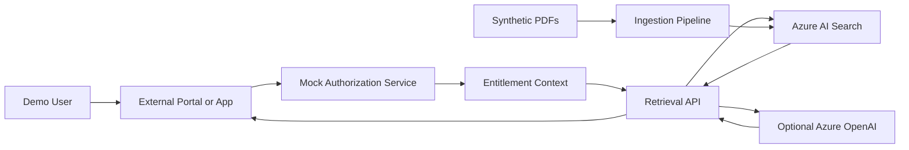

# Architecture

## Overview

This document describes the architecture of the Azure AI Search Entitlement Filtering Demo. The pattern demonstrated here is generic and reusable across any industry where fine-grained access control at retrieval time is required.

---

## Architecture Diagram



---

## Components

### 1. External Portal or Application

In a real system, this is your web application, portal, or API gateway. In this demo, the React frontend (`src/web/`) serves this role.

The application:
- Authenticates the user (WHO they are)
- Calls the authorization/entitlement service (WHAT they can access)
- Passes the userId to the retrieval API

### 2. Mock Authorization Service (`src/api/entitlements.py`)

In a real system, this would be your IAM system, Azure AD group lookup, Okta, a custom portal database, or any external service that knows which business entities each user can access.

In this demo, the authorization service is a hardcoded lookup of demo users. It exposes:
- `GET /api/users` — list all demo users
- `GET /api/entitlements/{userId}` — get a user's entitlement profile

The entitlement profile includes:
- `partnerId` — which partner this user belongs to
- `allowedClients` — which client entities they can see
- `allowedProductLines` — which product lines they can see
- `allowedRegions` — which regions they can see
- `canReadGlobalReferences` — whether they can read PublicDemoReference documents

### 3. OData Filter Builder (`src/api/filters.py`)

This module converts an entitlement profile into an Azure AI Search OData filter string.

Example output:
```
(partnerId eq 'PartnerAlpha' and search.in(clientId, 'ClientNorth', ',') and search.in(productLine, 'ProductLineA', ',') and search.in(region, 'RegionOne', ',')) or (classification eq 'PublicDemoReference')
```

Key behaviors:
- Deny-by-default: unknown users get `id eq 'DENIED_NO_ENTITLEMENTS_FOUND'`
- Never returns an empty or null filter
- API responses include the generated filter for demo transparency

### 4. Retrieval API (`src/api/`)

FastAPI application that:
1. Receives search requests (`POST /api/search`, `POST /api/chat`)
2. Looks up user entitlements
3. Builds the OData filter
4. Executes the filtered query against Azure AI Search
5. Returns only authorized chunks

The API never executes an unfiltered search for user queries.

### 5. Azure AI Search

Hosts the `entitlement-demo-index` index. Every document chunk in the index is tagged with entitlement metadata fields (partnerId, clientId, productLine, region, classification, allowedEntitlements).

At query time, the OData filter restricts results to only those documents the user is authorized to see.

Supports:
- Keyword search (always available)
- Vector search (requires Azure OpenAI embeddings)
- Hybrid search (keyword + vector)

### 6. Ingestion Pipeline (`src/ingestion/`)

Processes synthetic PDFs and uploads them to Azure AI Search:

1. `generate_sample_pdfs.py` — creates synthetic PDFs with fictional content
2. `ingest_documents.py` — orchestrates the full pipeline
3. `chunking.py` — splits document text into overlapping chunks
4. `embeddings.py` — generates vector embeddings (optional)
5. `index_schema.py` — defines the Azure AI Search index schema
6. `metadata.json` — entitlement metadata for each document

### 7. Optional Azure OpenAI

If configured:
- Embedding model generates vector representations for semantic search
- Chat model generates answers from filtered context chunks (RAG)

If not configured:
- Demo runs in keyword-only search mode
- `/api/chat` returns retrieval results without LLM-generated answers

---

## Data Flow: Search Request

```
User → Frontend → POST /api/search { userId, query }
                    ↓
               get_entitlements(userId)
                    ↓
               build_entitlement_filter(entitlements)
                    ↓ filter = "partnerId eq 'PartnerAlpha' and ..."
               execute_search(query, filter, searchMode)
                    ↓ Azure AI Search query with $filter applied
               [chunks matching filter]
                    ↓
               SearchResponse { results, filter, citations }
                    ↓
               Frontend displays results
```

## Data Flow: Ingestion

```
generate_sample_pdfs.py → sample-docs/*.pdf
ingest_documents.py:
  metadata.json → document metadata
  pypdf → extract text from PDF
  chunking.py → split into overlapping text chunks
  embeddings.py → generate vectors (if Azure OpenAI configured)
  → upload to Azure AI Search (entitlement-demo-index)
     each chunk includes: content, contentVector, partnerId,
     clientId, productLine, region, classification, allowedEntitlements
```

---

## Index Schema

The `entitlement-demo-index` includes these key fields:

| Field | Type | Filterable | Searchable | Purpose |
|---|---|---|---|---|
| id | String (key) | ✓ | | Unique chunk identifier |
| documentId | String | ✓ | | Source document identifier |
| chunkId | String | ✓ | | Position within document |
| title | String | ✓ | | Document title (for citations) |
| content | String | | ✓ | Full-text searchable content |
| sourceFile | String | ✓ | | Source PDF filename (for citations) |
| sourcePage | Int32 | ✓ | | Page number (for citations) |
| partnerId | String | ✓ | | Entitlement: partner |
| clientId | String | ✓ | | Entitlement: client |
| productLine | String | ✓ | | Entitlement: product line |
| region | String | ✓ | | Entitlement: region |
| classification | String | ✓ | | Document classification |
| allowedEntitlements | Collection(String) | ✓ | | All applicable entitlement tags |
| contentVector | Collection(Single) | | ✓ (vector) | Semantic embedding (optional) |

---

## Azure Resources

| Resource | Purpose |
|---|---|
| Azure AI Search | Document index and query engine |
| Azure Storage Account | Sample document storage |
| App Service | Backend API hosting |
| App Service Plan | Compute for App Service |
| Log Analytics Workspace | Centralized logging |
| Application Insights | API monitoring and telemetry |
| User-Assigned Managed Identity | Credential-free Azure resource access |

Optional (if available in the target region):
- Azure OpenAI — for embeddings and chat completion
